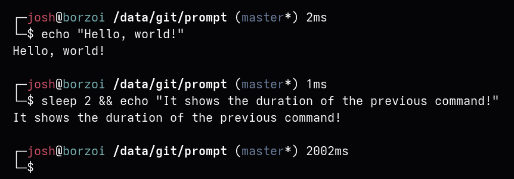

# prompt

`prompt` is a simple bash prompt (*PS1*) that shows some nice extraneous information.



## Features

Currently shows:

- The current user and hostname.
- The current directory.
- The current git branch, if the current directory is a working directory.
- Whether the current branch is dirty.
- The elapsed time for the last command.

## Installation

Download `.prompt` to your home directory, and then add the following to your `~/.bashrc`:

```sh
if [[ -n $PS1 && -f ~/.prompt ]]; then
  . ~/.prompt
  prompt_init_ps1
fi
```